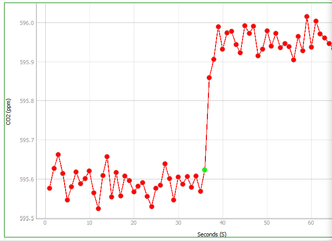

# Picarro and Licor Loop Code

Utility R functions for processing Picarro and Licor Data collected from a loop setup

## Description

This repository contains scripts meant for processing data on the picarro or Licor loop setup (as seen below).

### Background
A closed loop injection setup is preferable when you only have small concentrations of gas, or if the sample concentrations exceed the range of the instrument and a small volume is preferable to inject. 

  - The sample will be diluted by the gas in the loop, helping stabilize measurements and bringing the detection baseline firmly within the range of the gas analyzer. 
  - Concentration of the sample is determined by comparing the concentration of the loop prior to sample injection to the concentration of the loop after sample injection.


> Figure 1. Example of CO2 before and after sample injection.
  
Our closed-loop setup is based off of the Licor "Measuring Trace Gases in Small Samples" protocol[^1].

### Schematics

| Licor Loop Schematic | Picarro Loop Schematic |
|----------------------------------|--------------------------------------|
|  |  |
| *(view from front of analyzer)* | *(view from back of analyzer)* |
| **Instrument:** Li-7815 (but will also work for LI-7810, LI-7820) | **Instrument:** G2201-i with recirculation pump, A0702 |
| **Software Requires:** Li-Integrator | **Software Requires:** Default Picarro interface |

> [!NOTE]
> Recirculation loop wiring diagrams. Air flows from the circulation pump outlet through a 4-way brass valve that controls whether the loop is open to the atmosphere or closed. Next, air flows through the needle port where samples can be injected from a septa, after which they are mixed in a mason jar (which stabilizes the signal and also dilutes the gas). Finally, the mixed samples are sent into the CRDS analyzer where their gas concentration is read, before being recirculated through the circulation pump (circulation pump is internal in Licor, external in Picarro).

tbd: link to protocols and list

## Getting Started

### Dependencies

-   R version \>=4.0
-   R libraries: tidyverse, ggrepel (optional), here

### Installing

-   \<to add, yml installation instructions\>

``` r
install.packages("tidyverse")
install.packages("here")
install.packages("ggrepel")
```

## Repository guide

```         
.
├── README.md
├── Veff_calculations    <- scripts for calculation of the effective volume of the loop
├── calibration          <- tbd: scripts related to calibration of the instruments
├── SpreadsheetTemplates <- Templates for respiration measurments; Expected format for input for most code 
├── protocols            <- protocols for gas sampling, instrument maintenance, etc.
└── misc                 <- miscellaneous files that don't fit elsewhere
    ├── docs             <- documents referred to in repository    
    └── img              <- images

```

## Script overviews

### licor_veff_calcs.R or picarro_veff_calcs.R

-   Takes respiration spreadsheet as input

```         
code blocks for commands
```

## tbd: scripts for calculating and plotting gas flux for picarro and licor

## Protocol overviews

tbd list of protocols to add: - how to collect data for veff - how to take a standard curve - how to calibrate instrument (different for licor and picarro)

## Help

tbd:Any advise for common problems or issues.

```         
tbd
```

## Authors

Hannah Holland-Moritz [\@hhollandmoritz](https://github.com/hhollandmoritz)

## Version History

-   0.1
    -   Initial Release

## License

This project is licensed under the [NAME HERE] License - see the LICENSE.md file for details

## Acknowledgments

<insert funding information> <insert contribution information>

## References
[^1]:  Author unknown, "Measuring Small Gas Samples", LI-COR, Lincoln, NE, USA, Protocol No. 18944, Date. Accessed: 2025-12-02. [Online]. Available  [html](https://www.licor.com/support/Trace-Gas-Analyzers/topics/measuring-small-gas-samples.html), [pdf](misc/docs/TGA-Note-Small-Samples_18944.pdf)
