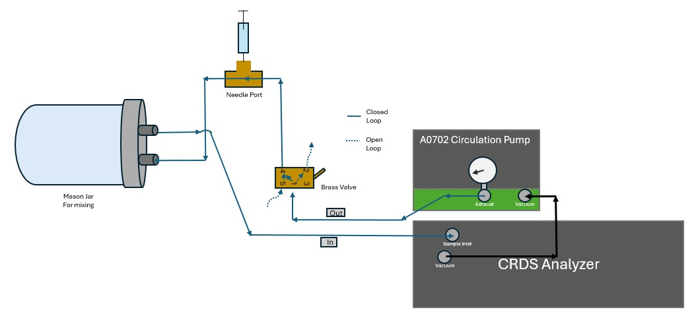

# Picarro and Licor Loop Code

Utility R functions for processing Picarro and Licor Data collected from a loop setup

## Description

This repository contains scripts meant for processing data on the picarro or Licor loop setup (as seen below).

| Licor Loop Schematic | Picarro Loop Schematic |
|----------------------------------|--------------------------------------|
|  |  |
| *(view from front of analyzer)* | *(view from back of analyzer)* |
| **Instrument:** Li-7815 (but will also work for LI-7810, LI-7820) | **Instrument:** G2201-i with recirculation pump, A0702 |
| **Software Requires:** Li-Integrator | **Software Requires:** Default Picarro interface |

This setup is inspired by the Licor Small Sample Gas Application "Closed loop method".[^1]

tbd: link to protocols and list

## Getting Started

### Dependencies

-   R version \>=4.0
-   R libraries: tidyverse, ggrepel (optional), here

### Installing

-   \<to add, yml installation instructions\>

``` r
install.packages("tidyverse")
install.packages("here")
install.packages("ggrepel")
```

## Repository guide

```         
.
├── README.md
├── Veff_calculations    <- scripts for calculation of the effective volume of the loop
├── calibration          <- tbd: scripts related to calibration of the instruments
├── SpreadsheetTemplates <- Templates for respiration measurments; Expected format for input for most code 
├── protocols            <- protocols for gas sampling, instrument maintenance, etc.
└── misc                 <- miscellaneous files that don't fit elsewhere
    └── img              <- images
```

## Script overviews

### licor_veff_calcs.R or picarro_veff_calcs.R

-   Takes respiration spreadsheet as input

```         
code blocks for commands
```

## tbd: scripts for calculating and plotting gas flux for picarro and licor

## Protocol overviews

tbd list of protocols to add: - how to collect data for veff - how to take a standard curve - how to calibrate instrument (different for licor and picarro)

## Help

tbd:Any advise for common problems or issues.

```         
tbd
```

## Authors

Hannah Holland-Moritz [\@hhollandmoritz](https://github.com/hhollandmoritz)

## Version History

-   0.1
    -   Initial Release

## License

This project is licensed under the [NAME HERE] License - see the LICENSE.md file for details

## Acknowledgments

<insert funding information> <insert contribution information>

## References
[^1]:  Author unknown, "Measuring Small Gas Samples", LI-COR, Lincoln, NE, USA, Protocol No. 18944, Date. Accessed: 2025-12-02. [Online]. Available  [html](https://www.licor.com/support/Trace-Gas-Analyzers/topics/measuring-small-gas-samples.html), [pdf](./misc/docs/TGA-Note-Small-Samples_18944.pdf)
